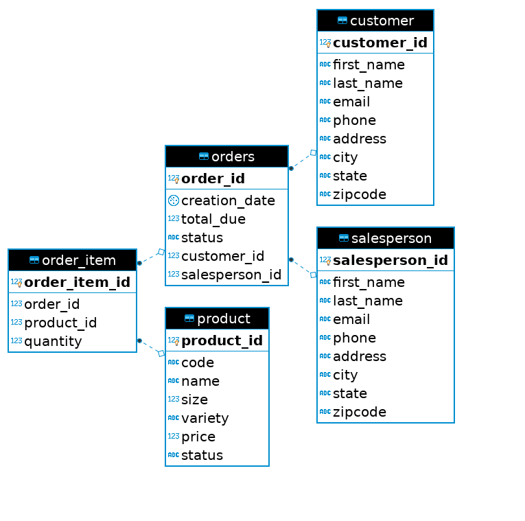
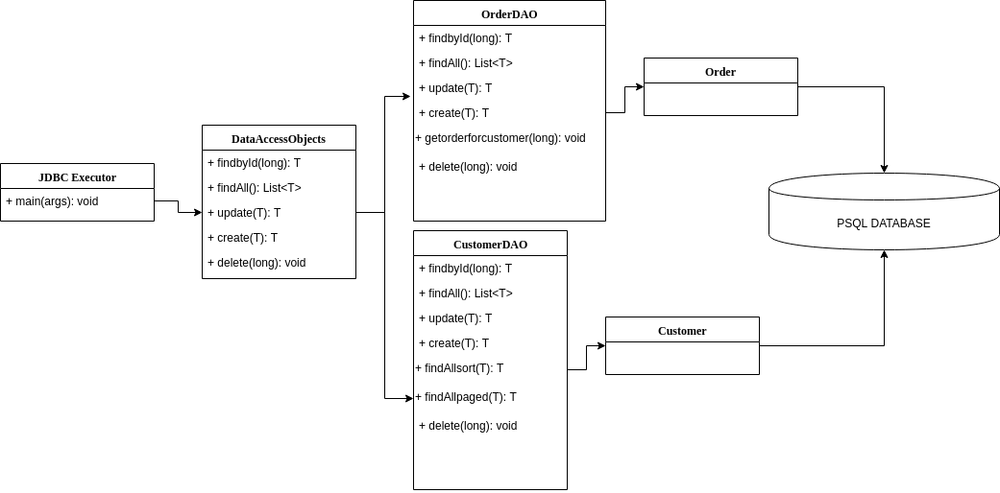

# Introduction
This project allows user to connect to postgresql database using JDBC APIs. Once we create a database and its schema.
We can connect to the database with hostname username and dababase name by running the excutor. The project could also 
implements CRUD functionailty with JDBC APIs, which allow users to perform actions to the psql RDBMS.  

# ER Diagram
  
There are five table in our database.  
`order_item`: contain the order id and the products id included in this order.  
`orders`: contain the order information such as status, date, customer_id and salesperson_id.  
`customer`: contain the customer information such as name email and address.  
`products`: contain the products information such as name, size and variety.  
`salesperson`: contain the salesperson information such as name email and address.  

# Design Patterns
## architecture
  
In this project we used DAO pattern or data access object pattern to allow access and store data of all kinds.
DAO saperate the low level data access API from high level business service. In our case, we have `customerDAO`
and `OrderDAO` that extends abstract class `DataAccessObject`, which contain functions that can generate `DataTransferObject`
`Customer` and `Order` and transfer it to the psql database to perform CRUD operation.  
