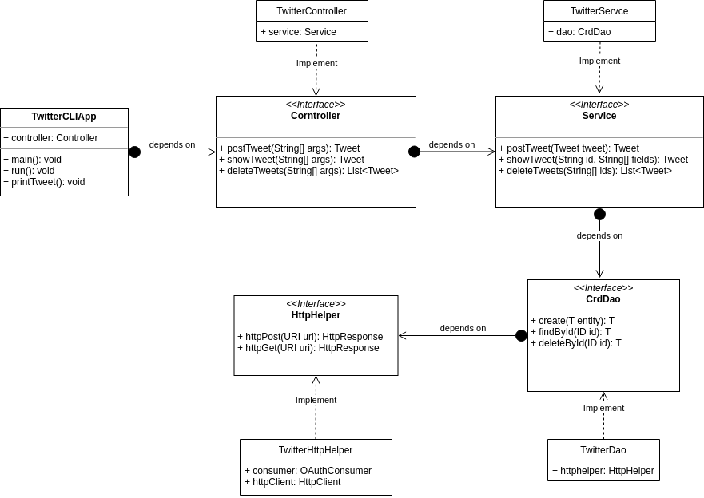

# Introduction
The twitter app allow users to post tweet with custom context including hashtag, tagging people
and location. Show tweet with a specific id and some fields and delete tweet with a specific id..
During the impelementation of the Twitter App. I gain a deeper understanding of the maven project structure.
The dependancy between each layer and the usage of DAO. I gain more experience of testing, and study the basic
of Springframework. 

# Design  
##UML diagram

##Component explaination
- `TwitterCLIapp`: TwitterCLIapp is the app it self and takes in the users input. Once the 
user call the app it will pass the command to the controller and invoke controller's functions
to complete the tasks.  
  
- `TwitterController`: TwitterController is used to validate the command passed by the app
and convert it into the tweet structure and invoke service's functions to complete the tasks.  
- `TwitterService`: TwitterService is used to validate the input passed by controller and invoke
DAO's function to complete the tasks.  
- `TwitterDao`: TwitterDao's tasks is convert the input passed by Service into URI format and 
invoke post and get function defines by HttpHelper.  
- `TwitterHttpHelper`: TwitterHttpHelper's tasks are build connection between our Twitter
app and Twitter server to make post show and delete tweet.  


# Quick Start
##MVN
- To build the project, go into the `java/twitter` directory and run `mvn package` in command 
line.
##Usage
#####PostTweet
- Usage: `TwitterCLIApp post "Text" "Longitude:Latitude"`  
`"Text"`: The text user wanna post.  
`"Longitude:Latitude"`: User's current location.  
#####ShowTweet
- Usage: `TwitterCLIApp show "ID" "Fields"`  
`"ID"`: The Id of the tweet that you want to show.  
`"Fields"`: Fields indicated which part to show in the result.
#####DeleteTweet
- Usage: `TwitterCLIApp delete "IDs"`  
`"IDs`: List of ID corresponding to the tweets user wants to delete.

# Model
The tweet model is uesd to store the http response in Json format from Twitter server.
The tweet model contain 11 fields. We use JsonParser in the dao package to parse the 
properties to a tweet object. In the 11 fields, the "coordinates", "entities", "hashtags"
, and "user_mentions" properties are corresponding to the `Coordinates`, `Entities`, 
`Hashtags`, and `UserMentions` objects in the model package. The Json showing below is an
example of a tweet object.
```
//Simplified Tweet Object 
{
   "created_at":"Mon Feb 18 21:24:39 +0000 2019",
   "id":1097607853932564480,
   "id_str":"1097607853932564480",
   "text":"test with loc223",
   "entities":{
      "hashtags":[],      //Find the object definition in twitter docs
      "user_mentions":[]  //Find the object definition in twitter docs
   },
   "coordinates":null,    //Find the object definition in twitter docs
   "retweet_count":0,
   "favorite_count":0,
   "favorited":false,
   "retweeted":false
}
```

# Improvements
1. Have more functions that can manipulating tweets.
2. Make it easy to show a tweet, instead of using id, we can use something easy to grep
such as user name or content.
3. Have more fields in the model to display more information.