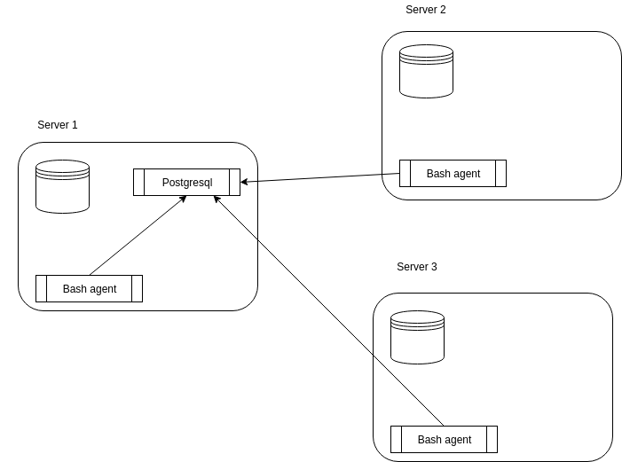

# Linux Cluster Monitoring Agent

## Introduction
The main task about this project is we want to record the hardware specification of 10 different nodes and monitor nodes resource usages such as memory
used in realtime. We collect data using shell scripts and store the data in postgreSQL database. This help the LCA team to monitor the hardware status
of each node and be able to analyze those data in order to prevent potential issues.

## Architecture and design

1)database
`ddl.sql` is used to create database and table to store the data we collect, we have two tables to store hardware infomation and usage.
`queries.sql` is used to write sql queries to answer business question in order to manage the cluster better.
2)scripts
`psql_docker.sh` is used to start docker server, create docker container and volumn
`host_info` is used to connect to the database, collect hardware infomation, and store in our psql database
`host_usage` is used to connect to the database, collect hardware usage, and store in our psql database

## usage
1.`psql_docker.sh` takes 1 to 2 inputs, it can be either start or stop the docker.
 * start:`psql_docker.sh start password`
 * stop: `psql_docker.sh stop`
2.`host_info.sh` takes 5 input `psql_host psql_port db_name psql_user psql_password`
 * we connect to `psql_host` through `psql_port` as `psql_user` with `psql_password` and store data in `db_name`.
3.`host_usage.sh` takes 5 input `psql_host psql_port db_name psql_user psql_password`
 * we connect to `psql_host` through `psql_port` as `psql_user` with `psql_password` and store data in `db_name`.
4.`ddl.sql` usage: `psql -h localhost -U postgres -w db_name -f ./.../ddl.sql`
5.`queries.sql` usage: `psql -h localhost -U postgres -w db_name -f ./.../queries.sql`

## Improvement
1.should have a better order of implemetation, with a better orgnization with the github branches.
2.check code more and commit less.
3.do not mess up with merging files.