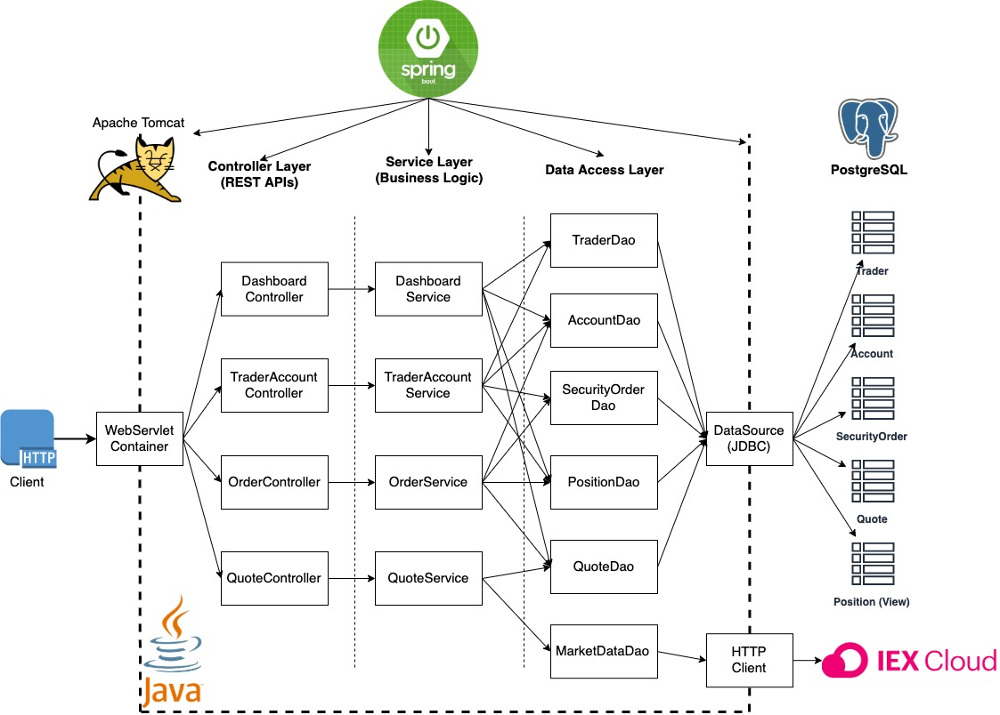

# SPRINGBOOT Trading simulator
Table of contents
* [Introduction](#Introduction)
* [Quick Start](#QuickStart)
* [Architecture](#Architecture)
* [REST API Usage](#RESTAPIUsage)
* [Docker Deployment](#DockerDeployment)
* [Improvements](#Improvements)

# Introduction
- Briefly explaination: The Springboots project is an online stock trading simulation REST API which can create new trader with it account, deposit and withdraw amount from the account and buying and selling orders. 
This API can be used by front-end developer and mobile-app developer to build a trading app.
- technologies used: The application fetch market data from [IEX CLOUD](https://iexcloud.io/console) and it store all the datas in to postgresql database. We use Spring framework to setup all the dependency for this
  application. 

# Quick Start
## Prequiresites
Docker(version 17.05 or higher), CentOS 7, JDK(version 1.8), Maven, IEX_CLOUD account. 
## Docker scritps
- Start the docker
```$xslt
systemctl status docker || systemctl start docker
```
- Create a new docker network
```$xslt
docker network create --driver bridge trading-net
```
- Build two images, one is for the database, and the other is for the application. build the image at the root directory alone with the Dockerfile

database image
```
cd ./springboot/psql
docker build -t trading-psl .  #docker builds ./Dokcerfile by default
docker image ls -f reference=trading-psl
```
app image
```$xslt
cd ./springboot/
docker build -t trading-app . #docker builds ./Dokcerfile by default
docker image ls -f reference=trading-psl
```
- Create docker container
```$xslt
docker run --name trading-psql-dev \
-e POSTGRES_PASSWORD=password \
-e POSTGRES_DB=jrvstrading \
-e POSTGRES_USER=postgres \
--network trading-net \
-d -p 5432:5432 trading-psql

IEX_PUB_TOKEN="your_token"
#start trading-app container which is attached to the trading-net docker network
docker run --name trading-app-dev \
-e "PSQL_URL=jdbc:postgresql://trading-psql-dev:5432/jrvstrading" \
-e "PSQL_USER=postgres" \
-e "PSQL_PASSWORD=password" \
-e "IEX_PUB_TOKEN=${IEX_PUB_TOKEN}" \
--network trading-net \
-p 5000:5000 -t trading-app
```
- Try trading-app with SwaggerUI (screenshot)  
After setting up the docker container, you can use the API by entering http://localhost:5000/swagger-ui.html from your web browser


# Architecture

- Controller layer
    - Controller Layer contains TraderAccountController, OrderController and QuoteController.
    - Controller Layer handles HTTP request from the clients and send responses back to clients, each controller 
    handles different requests by calling methods from corresponding services .
- Service layer
    - Service Layer contains TraderAccountService, OrderService and QuoteService.
    - Service Layer handles all the business logic such as deposit or withdraw funds to accounts, 
    buy or sell orders etc, and it calls corresponding DAO method to access the database.
- DAO layer
    - DAO layers contains TraderDao, QuoteDao, MarketDataDao, AccountDao, PositionDao and SecurityOrderDao
    - DAO layers implements several data access objects, retrieve market data from IEX Cloud using HTTP requests.
    persist data from Psql Database using JDBC.
- SpringBoot: webservlet/TomCat and IoC
    - Spring Boot framework is used in this application to create a microservice, manage and build up dependencies, 
    and the embedded tomcat servlet is used to deploy the whole app.
- PSQL and IEX
    - Application fetch market data from IEX Cloud and the data will be stored in PSQL databases.

# REST API Usage
## Swagger
Swagger allows you to describe the structure of your APIs so that machines can read them. 
The ability of APIs to describe their own structure is the root of all awesomeness in Swagger. 
We are using it because The swagger ui contain all API endpoint and models entity.
## Quote Controller
- Quote Controller handle all the http request that modify the `Quote` table in Psql database.
- briefly explain each endpoint
  - GET `/quote/dailyList`: Show all quote for this trading system in this trading system.
  - GET `/quote/iex/ticker/{ticker}`: Show iexQuote for a given ticker/symbol.
  - POST `/quote/tickerId/{tickerId}`: Add a new ticker/symbol to the quote table, so trader can trade this security.
  - PUT `/quote/`: Manually update a quote in the quote table using IEX market data.
  - PUT `/quote/iexMarketData`: Update all quotes in the quote table. Use IEX trading API as market data source.
## Trader Controller
- it can manage trader and account information. 
it can deposit and withdraw fund from a given account
- briefly explain each endpoint
  - DELETE `/trader/traderId/{traderId}`: Delete a trader IFF its account amount is 0 and no open positions. Also delete the associated account and securityOrders.
  - POST `/trader/`: TraderId and AccountId are auto generated by the database, and they should be identical. Assume each trader has exact one account.
  - POST `/trader/firstname/{firstname}/lastname/{lastname}/dob/{dob}/country/{country}/email/{email}`: TraderId and AccountId are auto generated by the database,and they should be identical. Assume each trader has exact one account.
  - PUT `/trader/deposit/traderId/{traderId}/amount/{amount}`: Deposit a fund to the account that associates with the given traderId. Deposit amount must be greater than 0
  - PUT `/trader/withdraw/traderId/{traderId}/amount/{amount}`: Withdraw a fund from the account that associates with the given traderId. Withdraw amount must not exceed account amount.
  
## Order Controller
- Order Controller handles http request that buy or sell orders.
- briefly explain each endpoint
  - POST `/order/marketOrder`: Submit a market order.

# Docker Deployment

- As the diagram showing above. After we run the docker commands such as build docker network,
create image and comtainer, and run the container. In the docker Host, docker daemon handle all
the command. Firs we create two image, `trading-psql` and `trading-app`, using the Dockerfiles located
`./springboot/psql/` and `./springboot/` to initialize the database and compile and package source code using maven.
 After that we create two container `trading-psql-dev` and `trading-app-dev` and attached to the network `trading-net`
 to allow them communicate with each other. 
# Improvements
If you have more time, what would you improve?
- Have more information store at each entity. 
- In Order Controller we could have two method to distinguish sell and buy.
- Could have more complicated relationship between trader and account, such as multiple account for one trader.
- For security. Trader should have password set up for its account.
- Allow negative amount in account alone with warning.